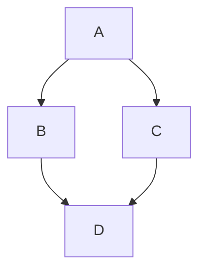

# 代码
{: .no_toc }

## 页内导航
{: .no_toc .text-delta }

1. TOC
{:toc}

---

## 行内代码

行内代码可以使用单个反向引号 `` ` `` 来包裹生成。

<div class="code-example" markdown="1">
Lorem ipsum dolor sit amet, `<inline code snippet>` adipisicing elit, sed do eiusmod tempor incididunt ut labore et dolore magna aliqua.

## 标题也可以用`<行内代码片段>`。
{: .no_toc }
</div>
```markdown
Lorem ipsum dolor sit amet, `<行内代码片段>` adipisicing elit, sed do eiusmod tempor incididunt ut labore et dolore magna aliqua.

## 标题也可以用`<行内代码片段>`。
```

---

## 语法高亮代码块

用 Jekyll 内建的 Rouge 语法高亮代码块引用只需使用三反向引号，后面再加上语言名称即可：

<div class="code-example" markdown="1">
```js
// Javascript code with syntax highlighting.
var fun = function lang(l) {
  dateformat.i18n = require('./lang/' + l)
  return true;
}
```
</div>

```js
// Javascript code with syntax highlighting.
var fun = function lang(l) {
  dateformat.i18n = require('./lang/' + l)
  return true;
}
```


语法高亮，行号和 HTML 压缩不能一起运行；**联合这些功能生成的 HTML 是无效的**。了解更多相关内容，查阅["带行号的代码"]()。

---

## 代码块生成示例

演示前端代码，有时直接展示代码直观形象。在你要展示的项目代码后要包含样式，你可以使用带有 `code-example` 类的 `<div>` 元素包裹代码块。如果你想使用 HTML 代替 Markdown，使用 `markdown="1"` 属性告诉 Jekyll 代码编写使用的 Markdown 格式……这就是获取元数据……

<div class="code-example" markdown="1">

<div class="code-example" markdown="1">

[Link button](https://just-the-docs.com){: .btn }

</div>
```markdown
[Link button](https://just-the-docs.com){: .btn }
```

</div>

<div class="code-example" markdown="1">

[Link button](https://just-the-docs.com){: .btn }

</div>
```markdown
[Link button](https://just-the-docs.com){: .btn }
```


---

## Mermaid 图表代码块
{: .d-inline-block }

新增 (v0.4.0)
{: .label .label-green }

用 [Mermaid](https://mermaid-js.github.io/mermaid/) 可以在 Markdown 中添加可视化图表。**该功能默认关闭**，所以如果想要使用 Mermaid 图表需要在配置文件 `_config.yml` 中添加关键字  `mermaid`。

最低配置也需要一个关键字 `version`（在 [JsDelivr](https://cdn.jsdelivr.net/npm/mermaid/) 匹配一个版本）：

```yaml
mermaid:
  # Version of mermaid library
  # Pick an available version from https://cdn.jsdelivr.net/npm/mermaid/
  version: "9.1.3"
```

附加配置选项通过 `_includes/mermaid_config.js` 加载。默认情况下文件内容是一个空对象：

```js
// _includes/mermaid_config.js
{}
```

这将加载默认设置。

对象内容应遵循 [Mermaid 配置 API](https://mermaid.js.org/config/configuration.html)。例如，覆盖主题，修改 `_includes/mermaid_config.js` 为：

```js
// _includes/mermaid_config.js
{
  theme: "forest"
}
```

一旦 Mermaid 安装成功，就可以在 Markdown 文件中使用了。在 Markdown 中一个简单的图表示例看起来这样：





生成图表：


*注意：基于演示目的，我们在这个站点启用了 Mermaid。默认情况下是未启用的，用户如果想要使用图表需要手动启用。*

### 使用本地 Mermaid 库

加载一个本地 Mermaid 版本也可以使用 `path` 关键字来指定库的位置。例如

```yaml
mermaid:
  version: "10.1.0"
  # 对于版本 (v10+)
  path: "/assets/js/mermaid.esm.min.mjs"
  # 对于版本 (<v10):
  # path: "/assets/js/mermaid.min.js"
  # 注意：从指定版本的 `mermaid/dist` 复制 `mermaid.esm.min.mjs` (v10+) 
  # 或者 `mermaid.min.js` (<v10) 以及关联的 `.map` 文件 to `/assets/js/`。
```
对于 Mermaid 版本 `>=10`，该文件可以使用 ESM 模块直接导入（而不使用普通的 `<script>` 标签）；用户应该使用的是 `mermaid.esm.min.mjs` 文件。而对于版本 `<10` 该文件则需要通过脚本标签加载；因为该文件是一个独立的 CJS 文件（例如 `mermaid.min.js`）。

{: .warning }
Mermaid 版本 `10.0` - `10.1` （可能是将来的版本） `mermaid.esm.min.mjs` 仍然使用相对路径进行导入。本地用户需要复制 `dist` 文件夹**所有**内容到指定路径（按照文件指定的相对路径）。Just the Docs 会关注 Mermaid 发布版本以及修订升级等。

### 在 AsciiDoc 中用 Mermaid

[AsciiDoc](https://asciidoc.org/) 用户（例如 [jekyll-asciidoc](https://github.com/asciidoctor/jekyll-asciidoc)）使用 Mermaid 可能需要额外设定。

默认情况下，AsciiDoc 生成 HTML 标记时 Mermaid 不能够正确被解析。最简单的解决方式是使用一个 [直通块](https://docs.asciidoctor.org/asciidoc/latest/pass/pass-block/)：

++++
<pre class="language-mermaid">
graph TD;
    accTitle: the diamond pattern
    accDescr: a graph with four nodes: A points to B and C, while B and C both point to D
    A-->B;
    A-->C;
    B-->D;
    C-->D;
</pre>
++++


最为一种替换方式，社区成员 [@flyx](https://github.com/flyx) 贡献了一个不需要附加标记的 Ruby 扩展。扩展[以一个 GitHub Gist](https://gist.github.com/flyx/9fff080cf4edc95d495bc661a002232c) 的方式放在这里。感谢 [@flyx](https://github.com/flyx)！

也支持 Mermaid 的 [Asciidoctor-diagram](https://docs.asciidoctor.org/diagram-extension/latest/) 扩展不推荐在 Just the Docs 中使用，因为它需要分别配置。例如对于主题，配置起来就不简单。

## 复制按钮
{: .d-inline-block }

新增 (v0.4.0)
{: .label .label-green }

代码块复制按钮可以通过配置文件 `_config.yml` 中的 `enable_copy_code_button` 关键词进行启用或者关闭。默认值为 `false`，用户需要自主选择确认。

```yaml
# 用于代码复制按钮
enable_copy_code_button: true
```

注意此功能运行需要 JavaScript 参与，如果 JavaScript 在浏览器中未启用，那么此功能将失效。另外此功能使用了 `navigator.clipboard`（只有在[上下文加密](https://developer.mozilla.org/en-US/docs/Web/Security/Secure_Contexts)环境中有效，类似于 HTTPS）。如果网站在一个非加密环境中使用，复制按钮将失效（[相关报告：#1202](https://github.com/just-the-docs/just-the-docs/issues/1202)）。
